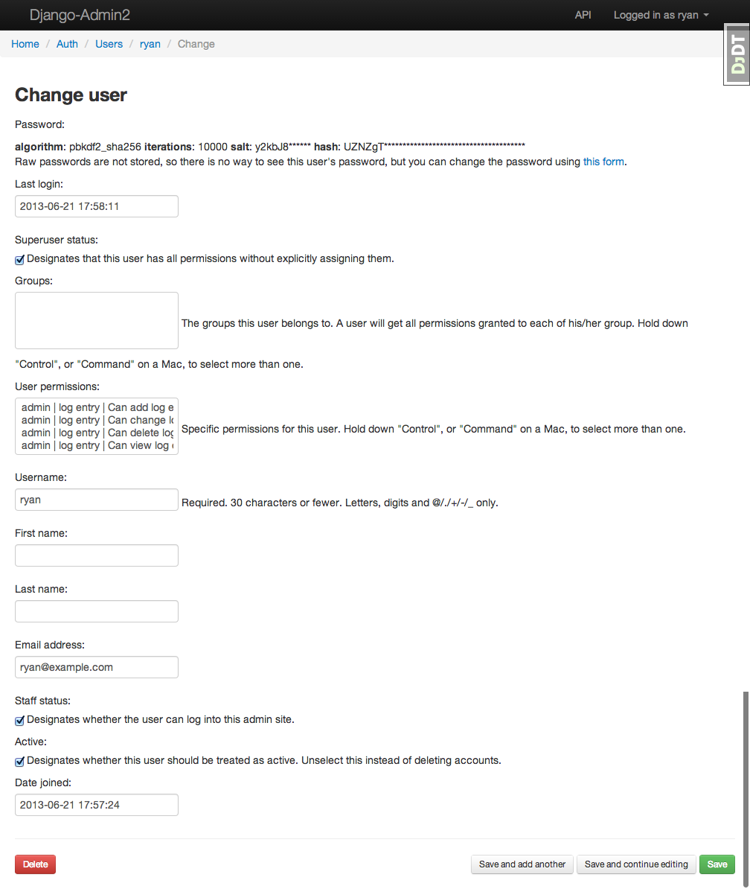

===============
django-admin2
===============

.. image:: https://travis-ci.org/pydanny/django-admin2.png
   :alt: Build Status
   :target: https://travis-ci.org/pydanny/django-admin2

**Warning:** This project is currently in an **alpha** state and currently not meant for real projects.

One of the most useful parts of ``django.contrib.admin`` is the ability to configure various views that touch and alter data. django-admin2 is a complete rewrite of that library using modern Class-Based Views and enjoying a design focused on extendibility and adaptability. By starting over, we can avoid the legacy code and make it easier to write extensions and themes.

Contributing
=============

Yes please! Please read our formal contributing document at: https://django-admin2.readthedocs.org/en/latest/contributing.html

Features
========

* Easy-to-extend API that follows similar patterns to ``django.contrib.admin``.
* Built-in RESTFUL API powered by ``django-rest-framework``.
* Default theme built on Twitter Bootstrap that is just starting to act like the current Django admin.
* Easy to implement theme system.
* Permission controls
* Custom actions
* Add/Change form inlines
* i18n

Requirements
=============

* Django 1.5+
* Python 2.7+ or Python 3.3+
* django-braces
* django-extra-views
* django-floppyforms
* django-rest-framework
* Sphinx (for documentation)

Basic Pattern
==============

Our goal is to make this API work:

.. code-block:: python

  # myapp/admin2.py
  # Import your custom models
  from .models import Post, Comment
  from django.contrib.auth.forms import UserCreationForm, UserChangeForm
  from django.contrib.auth.models import User

  import djadmin2

  class UserAdmin2(djadmin2.ModelAdmin2):
      create_form_class = UserCreationForm
      update_form_class = UserChangeForm

  #  Register each model with the admin
  djadmin2.default.register(Post)
  djadmin2.default.register(Comment)
  djadmin2.default.register(User, UserAdmin2)

Themes
========

The default theme is whatever bootstrap is most current. Specifically:

.. code-block:: python

    ADMIN2_THEME_DIRECTORY = "admin2/bootstrap/"

If you create a new theme, please define it thus:

.. code-block:: python

    ADMIN2_THEME_DIRECTORY = "admin2/foundation/"

Screenshots
===========

.. image:: screenshots/Site_administration.png
    :width: 722px
    :alt: Site administration
    :align: center
    :target: screenshots/Site_administration.png

.. image:: screenshots/Select_user.png
    :width: 722px
    :alt: Select user
    :align: center
    :target: screenshots/Select_user.png

History
=========

0.3.0 (2013-05-31)

  * HTML5 forms via floppyforms.
  * Many API improvements.
  * Added Breadcrumbs.
  * Added Login, Logout, ChangePassword views.
  * Added Actions.
  * Added support for inlines.
  * Added view based permission controls
  * Implement delete confirmations for child models.
  * Testrunner now can run on a specific test set or module.
  * Internal code refactoring to follow standards.
  * Moved to git-flow for accepting pull requests.
  * Model create/update pages now have save options.
  * Added i18n to all templates, much of internal code.
  * All print statements replaced with proper logging.
  * Design goals specified in the documentation.

0.2.0 (2013-05-19)

  * Birth! (Working Prototype)
  * Easy-to-extend API that follows similar patterns to django.contrib.admin.
  * Built-in RESTFUL API powered by django-rest-framework.
  * Default theme built on Twitter Bootstrap.
  * Easy to implement theme system.
  * Basic permission controls.
  * Testrunner
  * Documentation

0.1.1 (2013-05-17)

  * Code adoption from django-mongonaut.
  * Preperation for Django Circus sprints.

0.1 (2013-05-13)

  * Discussion with Russell Keith-Magee.
  * Inception.
