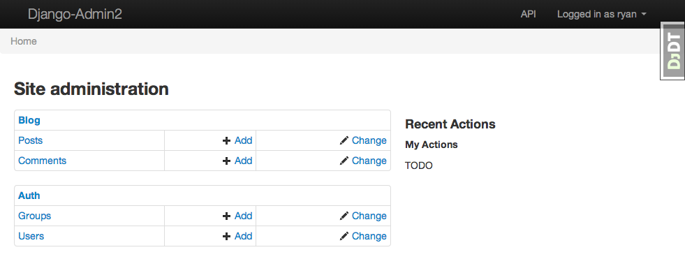
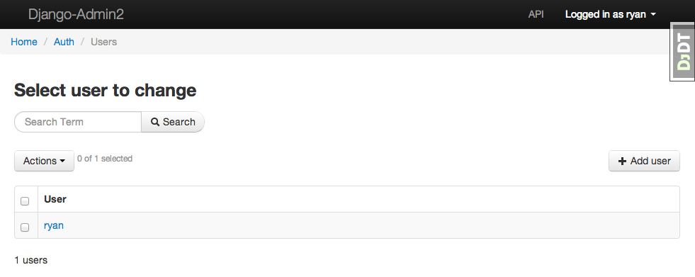

===============
django-admin2
===============

.. image:: https://travis-ci.org/pydanny/django-admin2.png
   :alt: Build Status
   :target: https://travis-ci.org/pydanny/django-admin2
.. image:: https://coveralls.io/repos/twoscoops/django-admin2/badge.png
   :alt: Coverage Status
   :target: https://coveralls.io/r/twoscoops/django-admin2
.. image:: https://pypip.in/v/django-admin2/badge.png
   :target: https://crate.io/packages/django-admin2/
.. image:: https://pypip.in/d/django-admin2/badge.png
   :target: https://crate.io/packages/django-admin2/

One of the most useful parts of ``django.contrib.admin`` is the ability to
configure various views that touch and alter data. django-admin2 is a complete
rewrite of that library using modern Class-Based Views and enjoying a design
focused on extendibility and adaptability. By starting over, we can avoid the
legacy code and make it easier to write extensions and themes.

Documentation: http://django-admin2.rtfd.org/

Features
=============

* Rewrite of the Django Admin backend
* Drop-in themes
* Built-in RESTful API

Screenshots
===========

Requirements
=============

* Django 1.5+
* Python 2.7+ or Python 3.3+
* django-braces_
* django-extra-views_
* django-floppyforms_
* django-rest-framework_
* Sphinx_ (for documentation)

.. _django-braces: https://github.com/brack3t/django-braces
.. _django-extra-views: https://github.com/AndrewIngram/django-extra-views
.. _django-floppyforms: https://github.com/brutasse/django-floppyforms
.. _django-rest-framework: https://github.com/tomchristie/django-rest-framework
.. _Sphinx: http://sphinx-doc.org/

Installation
============

Use pip to install from PyPI:

.. code-block:: python

   pip install django-admin2

Add djadmin2 and rest_framework to your settings file:

.. code-block:: python

    INSTALLED_APPS = (
        ...
        'djadmin2',
        'rest_framework', # for the browsable API templates
        'floppyforms', # For HTML5 form fields
        'crispy_forms', # Required for the default theme's layout
        ...
    )

Add djadmin2 urls to your URLconf:

.. code-block:: python

   # urls.py
   from django.conf.urls import patterns, include

   import djadmin2

   djadmin2.default.autodiscover()

   urlpatterns = patterns(
      ...
      url(r'^admin2/', include(djadmin2.default.urls)),
   )

How to write django-admin2 modules
=====================================

.. code-block:: python

  # myapp/admin2.py
  # Import your custom models
  from django.contrib.auth.forms import UserCreationForm, UserChangeForm
  from django.contrib.auth.models import User

  from .models import Post, Comment

  import djadmin2

  class UserAdmin2(djadmin2.ModelAdmin2):
      # Replicates the traditional admin for django.contrib.auth.models.User
      create_form_class = UserCreationForm
      update_form_class = UserChangeForm

  #  Register each model with the admin
  djadmin2.default.register(Post)
  djadmin2.default.register(Comment)
  djadmin2.default.register(User, UserAdmin2)

Drop-In Themes
===============

The default theme is whatever bootstrap is most current. Specifically:

.. code-block:: python

    # settings.py
    ADMIN2_THEME_DIRECTORY = "djadmin2/bootstrap/"

If you create a new theme, you define it thus:

.. code-block:: python

    # settings.py
    ADMIN2_THEME_DIRECTORY = "djadmin2/foundation/"

History
=========

0.5.0 (pending)

  * Implemented customizable value renderers
  * Implemented list filters using django-filters. Greatly supersedes what Django provides.
  * Implemented ModelAdmin2.save_on_top and ModelAdmin2.save_on_bottom
  * Implemented BooleanField icons for List and Detail views
  * Implemented default ``django.contrib.auth`` and ``django.contrib.sites`` registrations
  * Implemented the displayed of verbose field/method names in list view
  * Improved internal test coverage
  * Documentation for Context Variables in Themes
  * Corrected early nomenclature decisions
  * Completed Internationalization
  * Added django-admin2 to Transifex
  * Translations for French, Polish, Slovak, Chinese, German, Catalan, Italian, and Spanish.

0.4.0 (2013-06-30)

  * Implemented both Function- and Class-based Action views
  * Implemented ModelAdmin2.list_display
  * Implemented ModelAdmin2.fieldsets
  * Dropdown widget now displays the selected choice
  * Added support for callables in ModelAdmin2.list_display
  * Added screenshots to README
  * Added second example project
  * Fixed breadcrumbs
  * Default theme: Proper closing of template and media blocks
  * Default theme: Standardized indentation in default theme templates
  * Default theme: Pointed to CDN for JQuery
  * Default theme: Added basic style for login form
  * Default theme: Internationalized all text strings

0.3.0 (2013-05-31)

  * HTML5 forms via floppyforms.
  * Many API improvements.
  * Added Breadcrumbs.
  * Added Login, Logout, ChangePassword views.
  * Added Actions.
  * Added support for inlines.
  * Added view based permission controls
  * Implement delete confirmations for child models.
  * Testrunner now can run on a specific test set or module.
  * Internal code refactoring to follow standards.
  * Moved to git-flow for accepting pull requests.
  * Model create/update pages now have save options.
  * Added i18n to all templates, much of internal code.
  * All print statements replaced with proper logging.
  * Design goals specified in the documentation.

0.2.0 (2013-05-19)

  * Birth! (Working Prototype)
  * Easy-to-extend API that follows similar patterns to django.contrib.admin.
  * Built-in RESTFUL API powered by django-rest-framework.
  * Default theme built on Twitter Bootstrap.
  * Easy to implement theme system.
  * Basic permission controls.
  * Testrunner
  * Documentation

0.1.1 (2013-05-17)

  * Code adoption from django-mongonaut.
  * Preperation for Django Circus sprints.

0.1 (2013-05-13)

  * Discussion with Russell Keith-Magee.
  * Inception.
